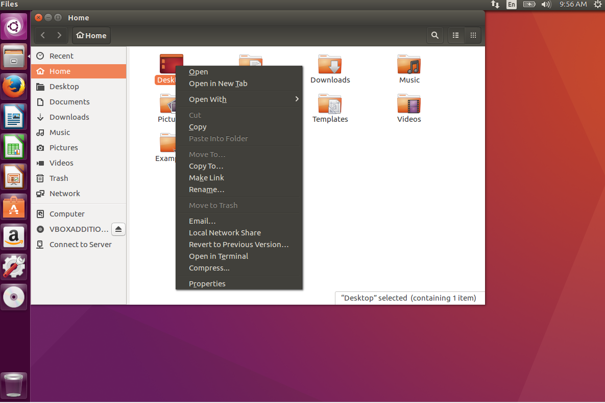
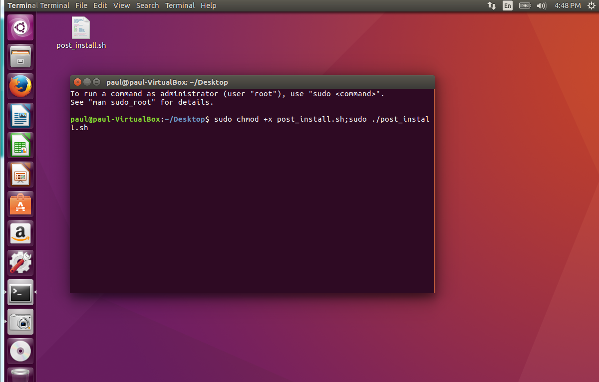
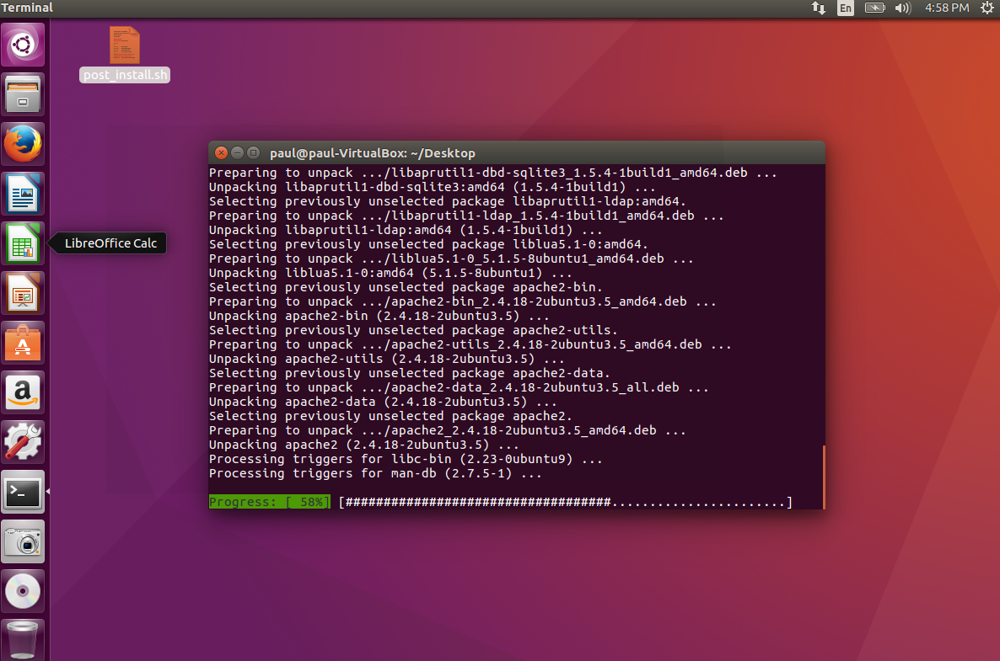
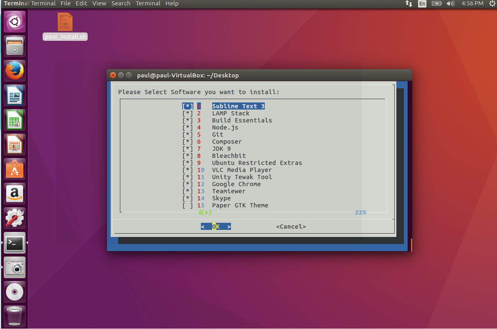
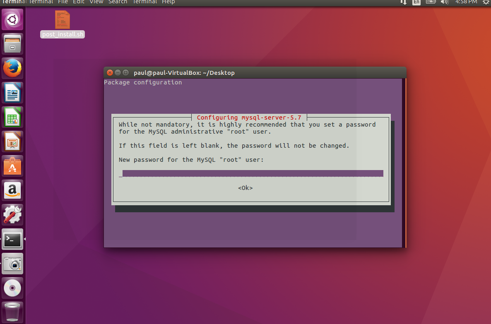

>Get your development environment up and running quickly!

In the post, we will go through an automated bash script, which will turn your fresh Ubuntu install into a fully fledged development machine within no time. This script I have tested on Ubuntu 16.04.3 as of Nov-13-2017. You'll get a chance to un-check the software that you are not interested in. I've included a range of software for you to choose from.

It is as simple as:

1. Download [Ubuntu 16.04.3](http://mirrors.bloomu.edu/ubuntu-releases/16.04.3/ubuntu-16.04.3-desktop-amd64.iso) and install it, if you do not already have Ubuntu installed
1. Copy the file [post_install.sh](https://gist.github.com/paulness/73238d84996cb8fc21aff644218a49a2) to your Ubuntu desktop open a terminal in your desktop and run the below command.
1. Open the terminal



And run the commands.

``` bash
# ensure the line endings are unix (after downloading from GIT)
sudo sed -i -e 's/\r$//' post_install.sh

# execute the script
sudo chmod +x post_install.sh; sudo ./post_install.sh
```

This is what you'll see in the terminal, right before you execute the script.



And once you press enter, you'll see text streaming down.



You'll see this prompt window; you may un-check software you do not wish to install. The themes I have unchecked by default since I prefer the default theme in Ubuntu.



After pressing OK to install the software, you'll see more prompts, type appropriate passwords, accept license agreements, accept certificates and choose the obvious options along the way to ensure all software is installed.


When you have finished, you'll have a range of software on your computer to help you with development.

Credits:
[Original bash script credit to KingsleyOmon-Edo](https://github.com/KingsleyOmon-Edo/)
