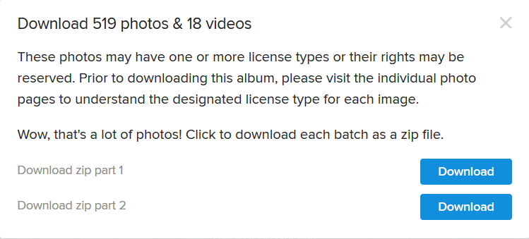
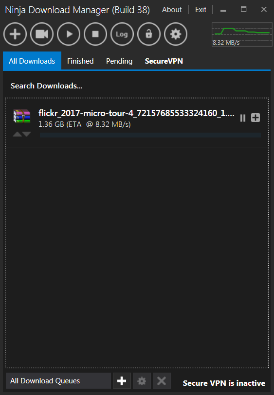

After going on an organized cycling trip, I attempted to download the [2.5GB photo archive from Flickr](https://www.flickr.com/photos/99699280@N07/sets/72157685533324160). So many of the download tools that I used were not capable of downloading this frickin file on my Time Warner Cable 50Mbps connection.

>Frustrating, seemingly impossible.

The tools I used that work fine with all other sites/files, just failed miserably with Flickr:

* Chrome
* FireFox
* XDM download manager
* FlashGet
* UGet

I really wanted those photos so was not ready to give up. It is positive that all of the extremely annoyed Flickr users who raised an open [issue](https://www.flickr.com/help/forum/en-us/72157674951404393/) want their photos too.

I came across [Ninja Download Manager (free edition)](https://ninjadownloadmanager.com/download-free), this tool never actually failed with the download. Despite seemingly dropping out hundreds of times, it always recovered. Be patient, ignore the statistics you see when downloading and you'll eventually get your archive out of Flickr.

Keep in mind that you may have luck on a different internet connection. I had all this trouble with my Time Warner Cable 50Mbps connection YMMV. Using ethernet instead of wireless would definitely help too. I hope this post helps you out.
