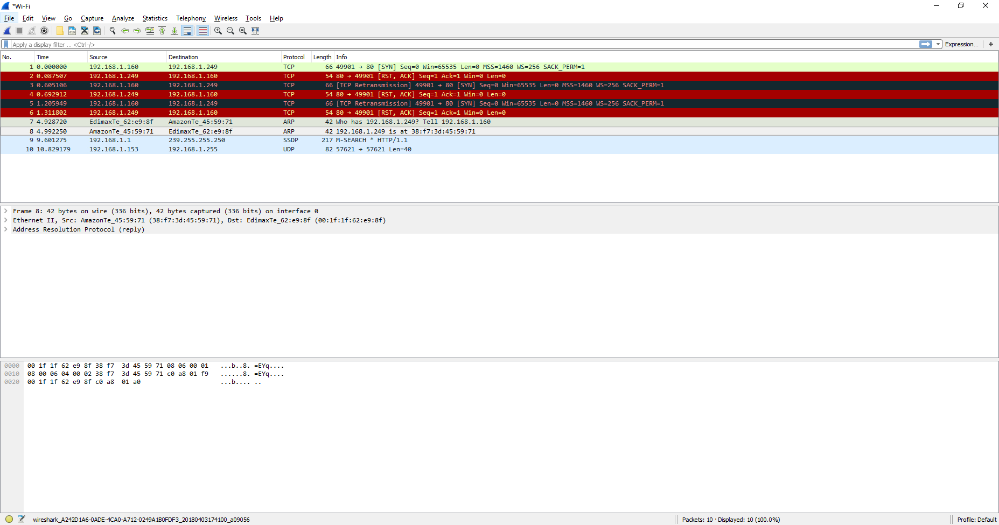

Last weekend I hosted a webpage on my machine at http://192.168.1.249 over port 80. This webpage was to be used by another machine on my network. Unfortunately, that day I was unable to access the webpage from the other machine.

After exhaustively checking firewalls, ports and the router settings, It turned out to be the presence of the Amazon Fire Stick on the local network that was screwing things up for me. I could not believe it! Not only does this junk slow down my WiFi by silently transmitting a new SSID on the same channel as my router, but it blocks local traffic on my network.

I am not an expert on networking, so my current solution to this problem is just to unplug my non-essential Amazon Fire Stick and chuck it across the room.

> If anybody can shine a light on this, please reply in the comments. It would be much appreciated.

Check out the two lines below captured in Wireshark. It seems that the presence of the Amazon Fire Stick causes confusion between who is hosting 192.168.1.249.

``` csv
7	4.92872	EdimaxTe_62:e9:8f	AmazonTe_45:59:71	ARP	42	Who has 192.168.1.249? Tell 192.168.1.160
8	4.99225	AmazonTe_45:59:71	EdimaxTe_62:e9:8f	ARP	42	192.168.1.249 is at 38:f7:3d:45:59:71
```

Check out the [wireshark packet dump file](wireshark-firestick-issue.pcapng) and [CSV](packets-during-session.csv). Also a screengrab below:
