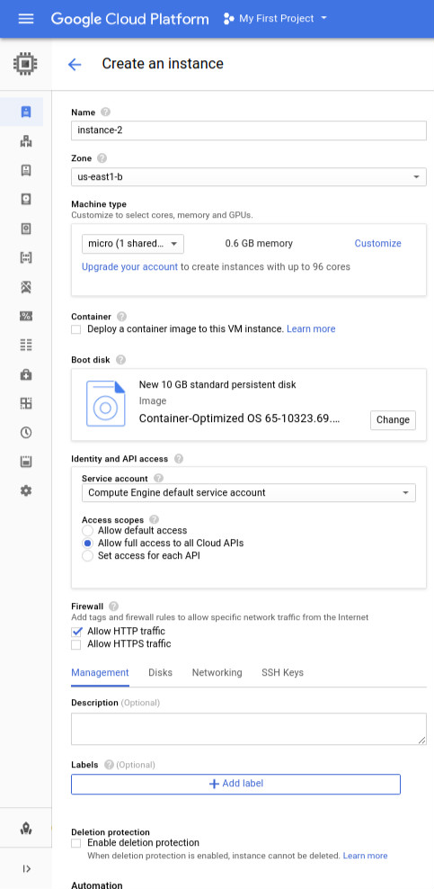
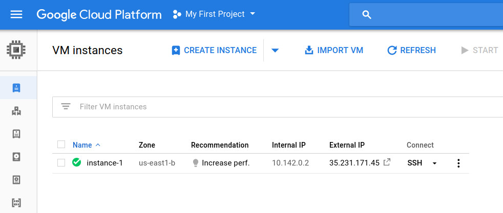
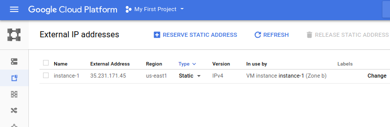
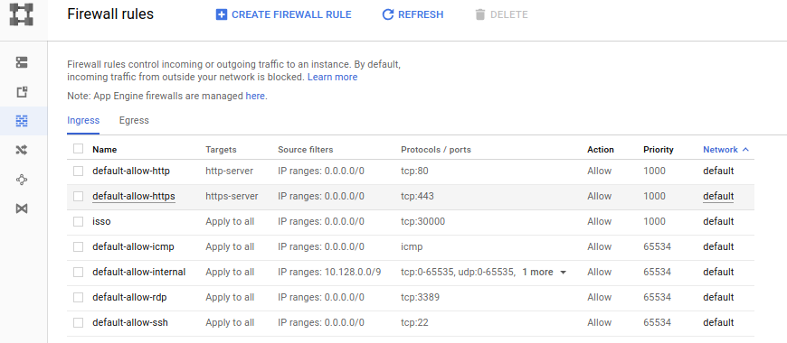
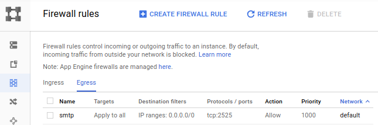
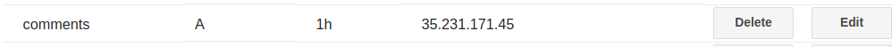
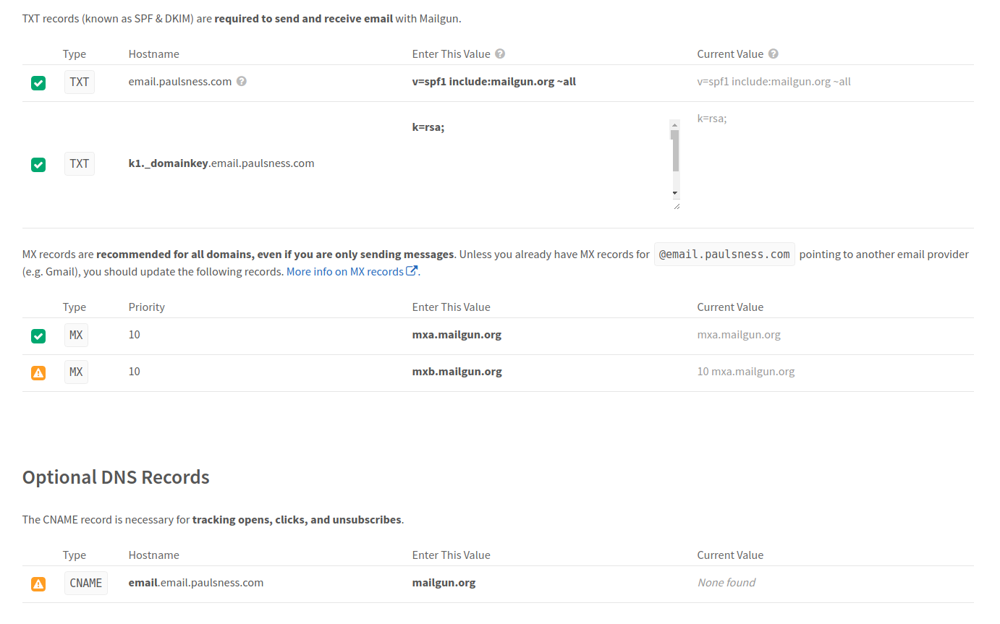
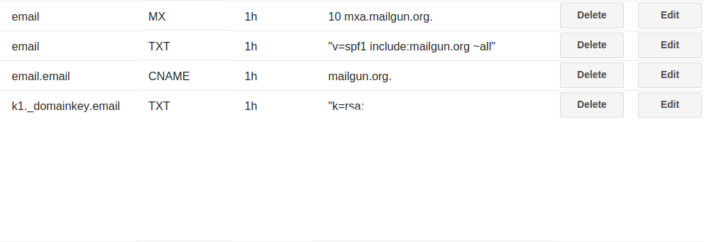
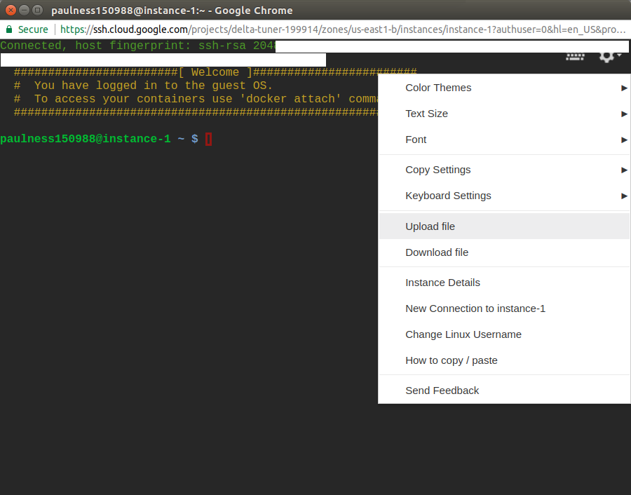
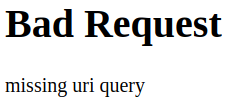

[Isso commenting](https://posativ.org/isso/) is an open source application that is a superior "in-place replacement" for Disqus and Facebook comments. Internally it is built with Python and SQLite. We will be running it inside a Docker container on the Google Compute Container Optimized OS. After completing the instructions in this guide, you'll just include a snippet on your site to get Isso comments working on your site.

> Let crack on to get tracking-free / ad-free commenting functionality on your site!

## Set up the VM instance

Go to the [Google Console for Instances](https://console.cloud.google.com/compute/instances) and click create instance. The configuration should match the following screenshot, and the price should be free!



You should now have a free tier VM set up in the Google Cloud console. See the screenshot below, where you see instance-1 is fully set up and running.



## Set up a reserved static IP address

[Click here](https://console.cloud.google.com/networking/addresses/list) to set up a reserved static IP address for the VM instance you created. The IP that I have set up is __35.231.171.45__ as displayed below.



### Setting up firewall settings

Open up the [Firewall rules](https://console.cloud.google.com/networking/firewalls/list) in the Google Cloud console. You need to open the ingress port tcp:30000 for Isso use. See below for example.



Next, you will need to open up the egress port tcp:2525 for outbound mail notifications. See below for example.



## Set up DNS records on your domains

Set up a subdomain A record __comments.yourdomain.com__ that points to your new static IP address. Shown below are my settings set up on Google Domains.



## Setting up email notifications for new comments

You will want notification when somebody comments on a post on your website. [Google Cloud prohibits instances sending mail on SMTP ports 25, 587, and 465](https://cloud.google.com/compute/docs/tutorials/sending-mail/) making it quite difficult to use most SMTP services. We will, therefore, be using Mailgun on port 2525 instead.

The steps are as follows:

* Create a free [Mailgun account](https://www.mailgun.com/google)
* Add a [domain in Mailgun](https://app.mailgun.com/app/domains). Use the format: email.yourdomain.com
* Complete the Mailgun domain verification process. Add all the DNS A records, TXT records and other records that Mailgun requires. See the Mailgun verification settings<sup>1</sup> and corrosponding Google Domain setup<sup>2</sup>.
* Add an [authorized recipient](https://app.mailgun.com/app/account/authorized) for which email address you want to be sent comment notifications
* Keep a Mailgun open as you will use the details later on

_1 - Mailgun verification_


_2 - Corrosponding settings in Google Domains_


## Setting up your Isso.conf configuration file

Please familiarize yourself with the Isso configuration options by looking at the [official documentation](https://posativ.org/isso/docs/configuration/server/) on this subject. 

I have included the contents of an  __isso.conf__ configuration file, for you to use as a template. Once completed it will be set up for email notifications and logging to a file, outside of the Docker container. __Please replace the values as mentioned in the inline comments.__

Please leave the file paths alone as these will be defined later when you run container.

``` yaml
[general]
 
dbpath = /db/comments.db # database location, do not change /db/ is a docker volume variable not a path
 # your website or blog (not the location of Isso!)
 # you can add multiple hosts for local development
 # or SSL connections. There is no wildcard to allow
 # any domain.
host =
    http://yourdomain.com/
    http://www.yourdomain.com/
    https://yourdomain.com/
    https://www.yourdomain.com/
    http://localhost:8000 #your local website development web address
notify = smtp
log-file=/db/log.txt # the log file will be saved to your docker volume /db/, do not change path

[server]
listen = http://0.0.0.0:8080/ # inside the docker instance the commenting server will run on 8080, do not change

[smtp]
username = postmaster@email.yourdomain.com # Your own Default SMTP Login in Mailgun here
password = yourpassword # Your own Default Password in Mailgun here
host = smtp.mailgun.org # SMTP Hostname in MailGun
port = 2525 # SMTP Port in MailGun
security = none # Authentication not required in MailGun
to = admin@yourdomain.com # The email you want to recieve the notification on
from = postmaster@email.yourdomain.com # Your own Default SMTP Login in Mailgun here
timeout = 10

[guard]
enabled = true
ratelimit = 2
direct-reply = 30
reply-to-self = true
require-author = false
require-email = false
```

## Deploying the Isso commenting software to the VM

Go back to the [Google Console](https://console.cloud.google.com/compute/instances) and start up an SSH session to the VM by clicking the SSH button. You should see a screen below.



Now you will need to upload the configuration file to the default home user folder and execute the following commands. This will create the folders that the container will use and move our configuration file to where it is going to be expected.

``` bash
sudo mkdir /var/lib/docker/isso
sudo mkdir /var/lib/docker/isso/db
sudo mkdir /var/lib/docker/isso/conf
mv isso.conf /var/lib/docker/isso/conf/isso.conf
```

Now pull the prebuilt Isso docker container into your VM instance.

``` bash
docker pull wonderfall/isso
```

You should be able to run the docker container with the following command. It will be listening on port 30000.

``` bash 
docker run --name isso -p 30000:8080 \
             --restart=always \
             -e USERID=1000 -e GROUPID=1000 \
             -v /var/lib/docker/isso/config:/config \
             -v /var/lib/docker/isso/db:/db \
             -d wonderfall/isso
```

You will never really have to look inside the Docker container, it will log errors to a file outside of the container. It can be treated like a black box.

## Testing the ISSO server from the outside world

Test your Isso server is running and accessible with your subdomain. For example http://comments.paulsness.com:30000

If you have followed all the instructions above, everything should be set up correctly. You should get a page that looks like the following.



## Inserting comment snippet on your site

Now all you need to do is insert the following snippet on your own website. Just be sure to change __'yourdomain'__ to your actual domain.

Pure HTML

``` html
<script data-isso="http://comments.yourdomain.com:30000/"
        data-isso-css="true"
        src="http://comments.yourdomain.com:30000/js/embed.min.js"></script>
<section id="isso-thread"></section>
```

or if you are using React

``` javascript
class PostComments extends React.Component {
  componentDidMount() {
    const scriptElem = document.createElement('script');
    scriptElem.type = 'text/javascript';
    scriptElem.setAttribute('data-isso', 'http://comments.yourdomain.com:30000/');
    scriptElem.setAttribute('data-isso-css', 'true');
    scriptElem.setAttribute('src', 'http://comments.yourdomain.com:30000/js/embed.min.js');
    scriptElem.async = true;

    const sectionElem = document.createElement('section');
    sectionElem.id = 'isso-thread';
    this.instance.appendChild(scriptElem);
    this.instance.appendChild(sectionElem)
  }

  render() {
    const { classes, post, slug } = this.props;

    return <div id="post-comments" className={classes.postComments} ref={el => (this.instance = el)} />;
  }
}
```

## Troubleshooting

Checking the log file for errors, such as if you are not receiving email notifications

``` bash
# To exit the less command press either the "q" or "Q" keys.
# To scroll down press the down key

less /var/lib/docker/isso/db/log.txt
```

Restarting the docker container, after making configuration changes

``` bash
# Check the currently running containers
docker ps

# Check the stopped containers
docker ps -a

# Example start of a container
docker start <containerid>

# Example stop of a container
docker stop <containerid>
```

## Manually backup/download comments database

Use the file download feature in SSH with the following file

``` bash
/var/lib/docker/isso/db/comments.db
```
